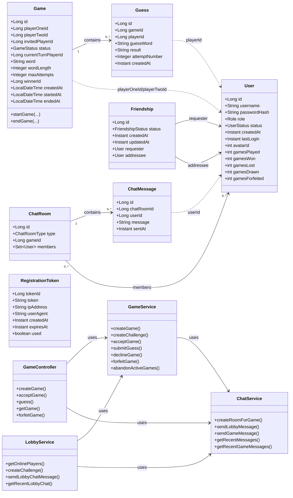

# Class Diagram (Mermaid)

```mermaid
classDiagram
    direction LR

    class User {
      +Long id
      +String username
      +String passwordHash
      +Role role
      +UserStatus status
      +Instant createdAt
      +Instant lastLogin
      +int avatarId
      +int gamesPlayed
      +int gamesWon
      +int gamesLost
      +int gamesDrawn
      +int gamesForfeited
    }

    class Game {
      +Long id
      +Long playerOneId
      +Long playerTwoId
      +Long invitedPlayerId
      +GameStatus status
      +Long currentTurnPlayerId
      +String word
      +Integer wordLength
      +Integer maxAttempts
      +Long winnerId
      +LocalDateTime createdAt
      +LocalDateTime startedAt
      +LocalDateTime endedAt
      +startGame(...)
      +endGame(...)
    }

    class Guess {
      +Long id
      +Long gameId
      +Long playerId
      +String guessWord
      +String result
      +Integer attemptNumber
      +Instant createdAt
    }

    class ChatRoom {
      +Long id
      +ChatRoomType type
      +Long gameId
      +Set~User~ members
    }

    class ChatMessage {
      +Long id
      +Long chatRoomId
      +Long userId
      +String message
      +Instant sentAt
    }

    class Friendship {
      +Long id
      +FriendshipStatus status
      +Instant createdAt
      +Instant updatedAt
      +User requester
      +User addressee
    }

    class RegistrationToken {
      +Long tokenId
      +String token
      +String ipAddress
      +String userAgent
      +Instant createdAt
      +Instant expiresAt
      +boolean used
    }

    class GameController {
      +createGame()
      +acceptGame()
      +guess()
      +getGame()
      +forfeitGame()
    }

    class LobbyService {
      +getOnlinePlayers()
      +createChallenge()
      +sendLobbyChatMessage()
      +getRecentLobbyChat()
    }

    class GameService {
      +createGame()
      +createChallenge()
      +acceptGame()
      +submitGuess()
      +declineGame()
      +forfeitGame()
      +abandonActiveGames()
    }

    class ChatService {
      +createRoomForGame()
      +sendLobbyMessage()
      +sendGameMessage()
      +getRecentMessages()
      +getRecentGameMessages()
    }

    GameController --> GameService : uses
    GameController --> ChatService : uses
    LobbyService --> GameService : uses
    LobbyService --> ChatService : uses
    GameService --> ChatService : uses

    Game "1" --> "0..*" Guess : contains
    ChatRoom "1" --> "0..*" ChatMessage : contains
    ChatRoom "0..*" --> "0..*" User : members

    Friendship --> User : requester
    Friendship --> User : addressee

    Game ..> User : playerOneId/playerTwoId
    Guess ..> User : playerId
    ChatMessage ..> User : userId
```

Notes:
- Solid associations represent entity/object relationships in code.
- Dotted associations represent ID-based references (no strict object field on both sides).
