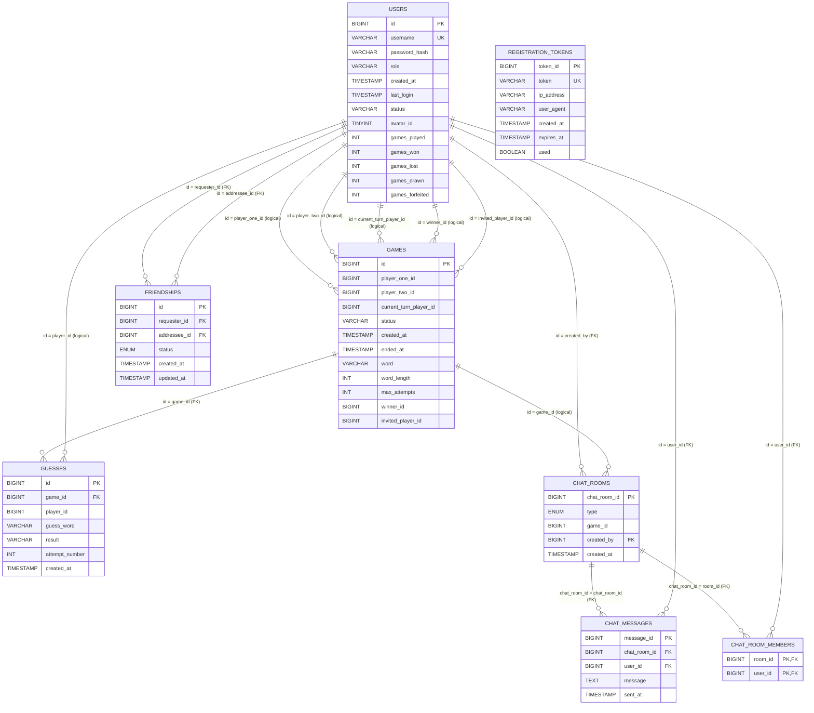

# ER Diagram (Mermaid)

Notes:
- `registration_tokens` is standalone (no FK relationships).
- Some relationships are marked `logical` because the column exists but no explicit FK constraint is present in the migrations.
