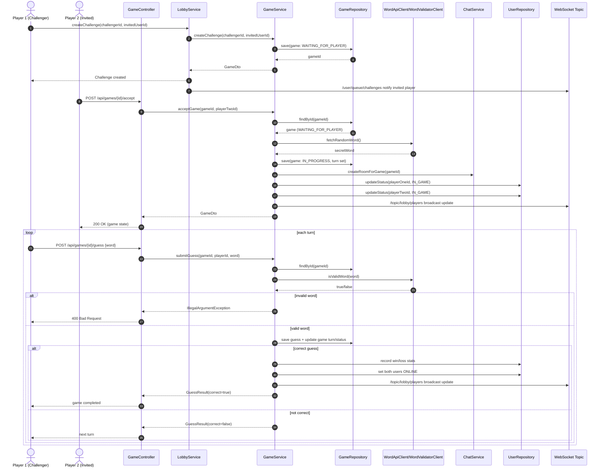

# Sequence Diagram (Mermaid)

```mermaid
sequenceDiagram
    autonumber
    actor P1 as Player 1 (Challenger)
    actor P2 as Player 2 (Invited)
    participant GC as GameController
    participant LS as LobbyService
    participant GS as GameService
    participant GR as GameRepository
    participant WR as WordApiClient/WordValidatorClient
    participant CR as ChatService
    participant U as UserRepository
    participant WS as WebSocket Topic

    P1->>LS: createChallenge(challengerId, invitedUserId)
    LS->>GS: createChallenge(challengerId, invitedUserId)
    GS->>GR: save(game: WAITING_FOR_PLAYER)
    GR-->>GS: gameId
    GS-->>LS: GameDto
    LS-->>P1: Challenge created
    LS->>WS: /user/queue/challenges notify invited player

    P2->>GC: POST /api/games/{id}/accept
    GC->>GS: acceptGame(gameId, playerTwoId)
    GS->>GR: findById(gameId)
    GR-->>GS: game (WAITING_FOR_PLAYER)
    GS->>WR: fetchRandomWord()
    WR-->>GS: secretWord
    GS->>GR: save(game: IN_PROGRESS, turn set)
    GS->>CR: createRoomForGame(gameId)
    GS->>U: updateStatus(playerOneId, IN_GAME)
    GS->>U: updateStatus(playerTwoId, IN_GAME)
    GS->>WS: /topic/lobby/players broadcast update
    GS-->>GC: GameDto
    GC-->>P2: 200 OK (game state)

    loop each turn
      P1->>GC: POST /api/games/{id}/guess {word}
      GC->>GS: submitGuess(gameId, playerId, word)
      GS->>GR: findById(gameId)
      GS->>WR: isValidWord(word)
      WR-->>GS: true/false
      alt invalid word
        GS-->>GC: IllegalArgumentException
        GC-->>P1: 400 Bad Request
      else valid word
        GS->>GR: save guess + update game turn/status
        alt correct guess
          GS->>U: record win/loss stats
          GS->>U: set both users ONLINE
          GS->>WS: /topic/lobby/players broadcast update
          GS-->>GC: GuessResult(correct=true)
          GC-->>P1: game completed
        else not correct
          GS-->>GC: GuessResult(correct=false)
          GC-->>P1: next turn
        end
      end
    end
```

Notes:
- This covers the main challenge/accept/guess flow.
- Chat sends and receives run through `ChatService` and WebSocket topics in parallel with gameplay.
